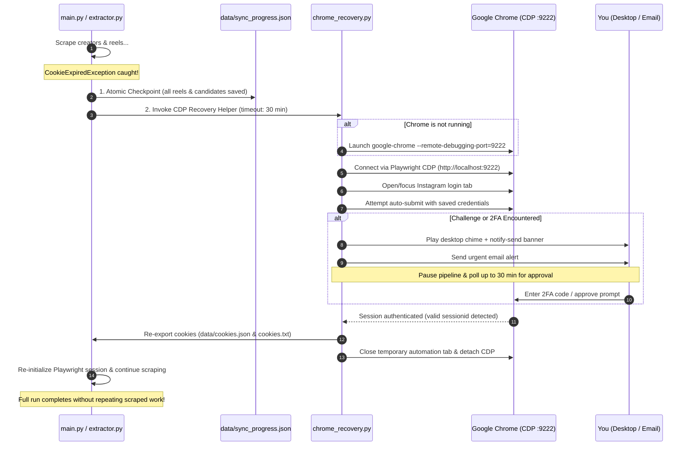

# Technical Architecture: Automated Chrome CDP Mid-Run Cookie Recovery

This document summarizes the end-to-end architecture designed through our `/grill-me` session. It enables the Instagram Digest pipeline to automatically recover from expired cookies mid-run using your live Google Chrome session on Linux via the Chrome DevTools Protocol (CDP), without requiring an external AI to supervise the process.

---

## 1. System Configuration

To allow Python to communicate directly with your running Chrome instance without creating duplicate profiles or interfering with daily browsing:

* **File:** `~/.config/chrome-flags.conf`
* **Configuration:**
  ```text
  --remote-debugging-port=9222
  ```
* **Effect:** Whenever Google Chrome starts on Linux (via desktop icon, application launcher, or CLI), it automatically opens DevTools port `9222` bound strictly to `localhost` on your `Default` user profile.
* **Security & Isolation:** The port is only accessible to local processes running on your machine. Your existing bookmarks, extensions, and saved Google Password Manager credentials remain completely intact.

---

## 2. End-to-End Recovery Flow



---

## 3. Core Architectural Components

### A. Zero-Loss Checkpoint Guarantee
Before any recovery attempt is made:
* The pipeline immediately calls `_write_sync_progress("cookie_paused", ...)` in [`main.py`](file:///home/kedarnath-reddy-vallaboina/Instagram_digest/main.py).
* All candidate reels, channel progress, and downloaded video files gathered up to that exact second are safely flushed to `data/sync_progress.json`.
* If power is lost or the machine powers down, the run can be resumed later without re-scraping a single channel.

### B. Dedicated Recovery Module (`chrome_recovery.py`)
A lightweight, self-contained Python module that handles:
1. **Health Check:** Probes `http://localhost:9222/json/version` to check if Chrome is alive.
2. **Auto-Launch Fallback:** If Chrome is closed, starts Chrome in the background with `--remote-debugging-port=9222 https://www.instagram.com/`.
3. **CDP Attachment:** Connects using `playwright.chromium.connect_over_cdp("http://localhost:9222")`.
4. **Login Automation:**
   * Navigates to `https://www.instagram.com/accounts/login/`.
   * If credentials are saved, triggers the login submission.
   * Monitors URL and DOM changes to detect whether the user reaches the feed or hits a challenge (`/two_factor/`, `/challenge/`, `checkpoint_required`).
5. **Interactive Wait Loop:**
   * Plays a system chime (`paplay /usr/share/sounds/freedesktop/stereo/message.oga` or fallback bell).
   * Displays a desktop notification via `notify-send "Instagram Digest" "Instagram session expired. Please approve 2FA in Chrome."`.
   * Sends an email alert with direct instructions.
   * Polls every 3 seconds for up to **30 minutes** for the login challenge to resolve.

### C. In-Memory Session Reload & Scraper Hot-Swap
Once valid cookies are confirmed:
1. Calls [`cookie_exporter.export_instagram_cookies()`](file:///home/kedarnath-reddy-vallaboina/Instagram_digest/cookie_exporter.py) to update `data/cookies.json` and root `cookies.txt`.
2. Reloads the active Playwright context in [`extractor.py`](file:///home/kedarnath-reddy-vallaboina/Instagram_digest/extractor.py) with the new session headers without killing the running Python process.
3. Resumes scraping the remaining creators on the schedule seamlessly.

### D. Graceful Fallback & Timeout
If 30 minutes elapse without human login or resolution:
* The module cleanly logs the timeout and detaches from Chrome.
* The pipeline exits with return code `2` (the standard checkpoint exit code).
* The progress remains permanently safely parked on disk.
* When you next boot or log into your machine, the existing `resume_pending.sh` auto-resume script picks up the run automatically.

---

## 4. Proposed Code Changes & Impact Map

| File | Change | Purpose |
| :--- | :--- | :--- |
| `~/.config/chrome-flags.conf` | [NEW / UPDATE] | Add `--remote-debugging-port=9222` for Chrome. |
| `chrome_recovery.py` | [NEW] | Core CDP connection, auto-login, desktop alert, and wait-loop logic. |
| [`main.py`](file:///home/kedarnath-reddy-vallaboina/Instagram_digest/main.py) | [MODIFY] | Hook `CookieExpiredException` handlers during extraction and discovery to call `chrome_recovery` before aborting. |
| [`extractor.py`](file:///home/kedarnath-reddy-vallaboina/Instagram_digest/extractor.py) | [MODIFY] | Add hot-reload capability to `InstagramSession` to update cookie storage without tearing down the extractor state. |
| `tests/test_chrome_recovery.py` | [NEW] | Unit tests with mocked CDP endpoints covering auto-login, 2FA wait loop, and timeout scenarios. |

---

## 5. Comparison: Before vs. After

| Scenario | Current Behavior | New CDP Architecture |
| :--- | :--- | :--- |
| **Cookies expire at 11:30 PM mid-scrape** | Pipeline immediately aborts with exit code 2, sends email, stops scraping. | Pipeline checkpoints work, opens Chrome, logs in automatically with saved password, and resumes immediately. |
| **Instagram prompts for 2FA / SMS code** | Week is skipped or paused; requires manually opening Chrome, logging in, and running CLI commands. | Chimes your laptop, displays desktop alert, pauses for up to 30 min; resumes the moment you tap approve. |
| **Already scraped 150 reels before error** | Salvaged into checkpoint, but process ends; digest delivery is delayed until manual resume. | 150 reels are preserved in memory; remaining 100 reels are scraped immediately after recovery. |
| **AI token consumption** | 0 tokens (manual restart). | **0 tokens** (100% native local Python & Playwright automation). |
