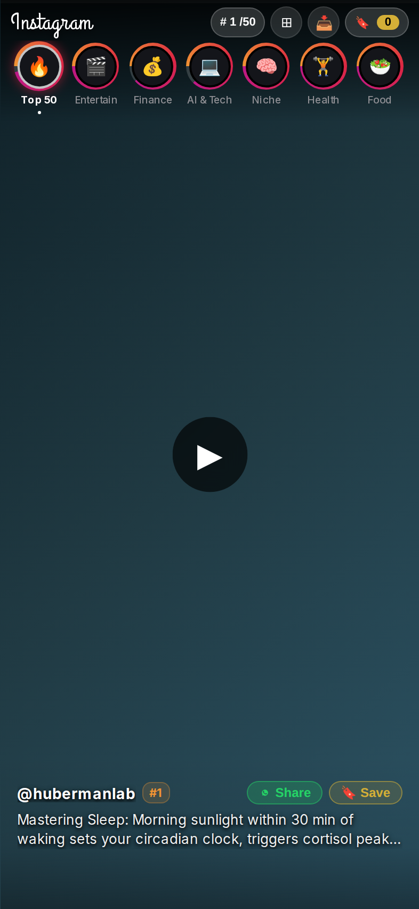
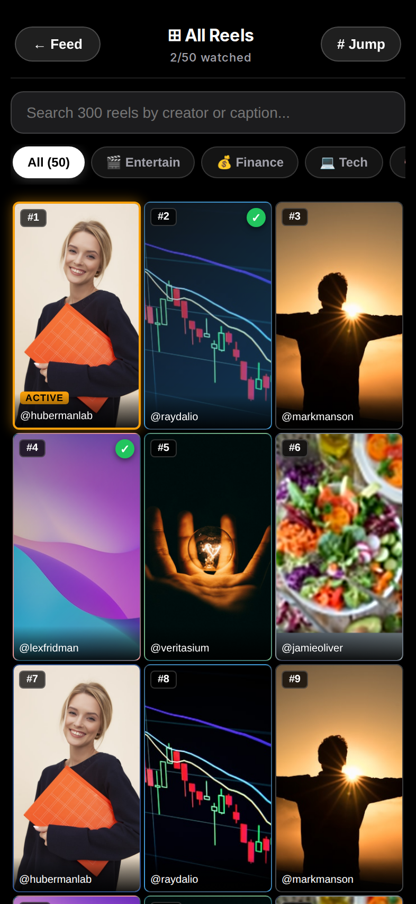
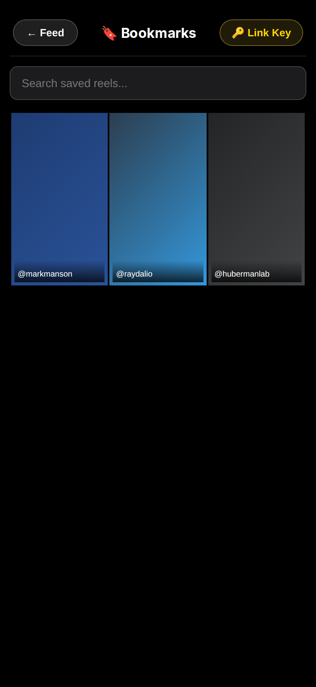
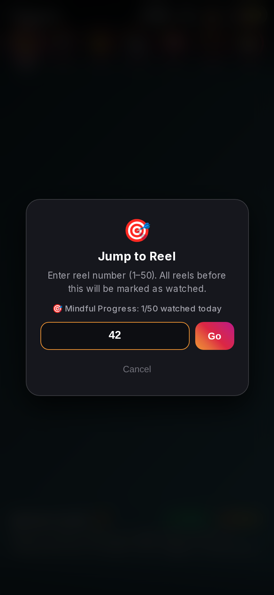
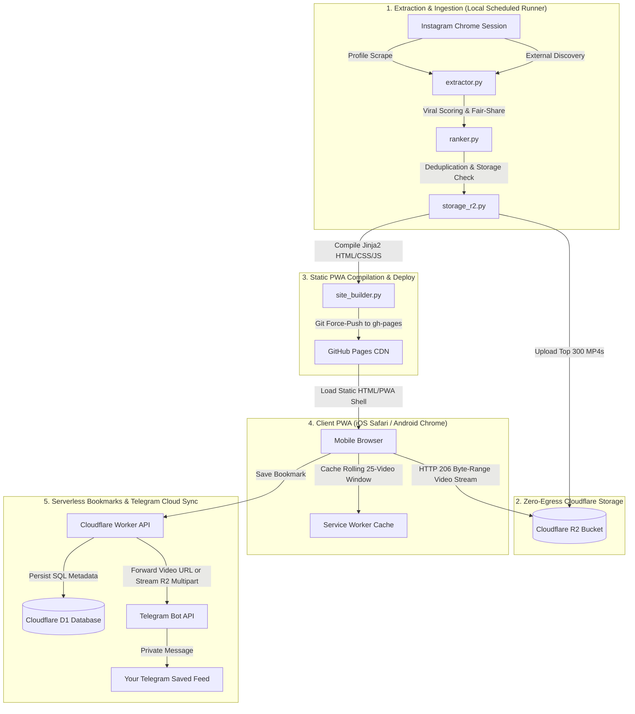

# 📱 Instagram Digest

> **An intentional, ad-free, high-signal weekly digest of Instagram Reels curated into a distraction-free Progressive Web App (PWA).**  
> Replaces algorithmic doom-scrolling with a finite, curated media briefing. Hosted on GitHub Pages with zero-bandwidth video streaming via Cloudflare R2 and permanent bookmark syncing to Telegram — **100% free forever ($0.00/mo)**.

---

[](LICENSE)
[](#the-000-forever-zero-cost-architecture)
[](#pwa-installation-guide)
[-orange.svg)](#4-zero-egress-cloudflare-r2-media-delivery)
[](#5-hybrid-bookmarks--telegram-cloud-sync)
[](https://www.python.org/)

---

---

## 📸 Visual Tour

<p align="center">
  
  
  
  
</p>

<p align="center">
  <em>(Left to Right: Full-Screen Vertical Feed · 3-Column Visual Grid View · Hybrid Bookmarks Library · Mindful Jump Dialog)</em>
</p>

---

## 💡 Why Instagram Digest?

Mainstream social media algorithms are engineered for **infinite retention** — optimizing for time-on-screen rather than signal. Users open an app to check one creator and emerge 45 minutes later trapped in an algorithmic rabbit hole of low-value dopamine loops.

**Instagram Digest inverts this model:**
1. **Finite Batches:** Delivers a curated, fixed weekly digest of top reels (default: 300) from creators you specifically respect, supplemented by high-engagement external discovery.
2. **Strict Watched Tracking:** Reels are automatically marked as watched in client-side storage as you advance. Unwatched items are prioritized; previously watched reels are dimmed.
3. **Celebratory Finish:** Once you watch all reels, you are presented with a celebratory *"You're All Caught Up! 🎉"* screen — no endless pagination, no algorithmically inserted filler.
4. **Mindful Pace:** A configurable daily check-in counter (e.g. 50 reels/day target) provides a gentle pause to maintain deliberate media consumption.

---

## ✨ Key Features

### 1. Intentional Curation & Anti-Doomscroll Engine
* **Configurable Weekly Target:** Extracts and ranks a finite batch of the highest-signal reels (default 300 via `TOP_DIGEST_COUNT`), with on-demand `--expand` capability.
* **Persistent Watched History:** Tracks watched reel IDs in browser `localStorage` and syncs dual-layer progress to local desktop servers. Departed reels are marked immediately upon swiping.
* **All Caught Up Screen:** An explicit end-of-feed milestone celebration preventing unconscious looping.
* **Daily Mindful Check-in:** Soft check-in reminder upon reaching your daily target (e.g., 50 reels) with quick *"Take a Break"* or *"Continue"* options.

### 2. Native Mobile-First PWA Experience
* **Cinema Aspect Ratio Preservation:** Strict `object-fit: contain` scaling ensures portrait (9:16), square (1:1), and landscape videos are never cropped or distorted.
* **Floating Glass Overlay:** High-contrast text drop shadows over subtle transparent scrims eliminate clunky black header bars.
* **Notch & Home Indicator Clearance:** Optimized for modern mobile displays (iOS Dynamic Island, iPhone notches, Android navigation bars) with adaptive `env(safe-area-inset-*)` padding.
* **Gesture Controls:**
  - **Press-and-Hold Right Edge:** Latches `2x` fast-forward speed with visual indicator pill. Tap to return to 1x.
  - **Double-Tap Center / Key `F`:** Triggers native immersive fullscreen.
  - **Horizontal Drag:** Real-time scrubbing HUD with timestamps and seek deltas.
  - **Tap Unmute:** Persistent global audio state across reels.

### 3. 3-Column Visual Grid View
* **Fast Visual Browsing:** Tap `⊞` in the header (or press `V` on desktop) to open a high-density 3-column explore grid of all 300 reels.
* **Real-Time Instant Search:** Filter across all 300 reels in real time by creator handle, caption keywords, or rank numbers.
* **Horizontal Category Chips:** One-tap filtering across categories: `All (300)`, `🎬 Entertain`, `💰 Finance`, `💻 Tech`, `🧠 Niche`, `🏋️ Health`, `🥗 Food`.
* **Visual Status Hierarchy:**
  - Unwatched reels display full-opacity posters and rank badges (`#01`).
  - Watched reels are dimmed with a glowing green checkmark badge (`✓`).
  - Active reel is highlighted with an amber glowing border and `ACTIVE` tag.
* **Instant Feed Jump:** Tapping any card in the grid closes the grid and immediately scrolls to and plays that reel in the vertical feed (`goToCard(card, { play: true })`).

### 4. Zero-Egress Cloudflare R2 Media Delivery
* **Zero Egress Bandwidth Fees:** All high-bitrate MP4 video streaming is offloaded to Cloudflare R2 object storage ($0.00 egress costs), keeping GitHub Pages ultra-lean (~2 MB static HTML/CSS/JS).
* **Immutable Content-Addressed Identity:** Videos are keyed by immutable Instagram reel IDs. Re-ranks, re-orders, and title adjustments never orphan cached files or re-download media.
* **Rolling Purge & Quota Guard:** Automated rolling retention prunes media files and weekly site archives older than configured retention periods. A pre-flight quota guard aborts before exceeding safe storage limits.

### 5. Hybrid Bookmarks & Telegram Cloud Sync
* **One-Tap Permanent Saving:** Tap `🔖 Save` on any reel to bookmark it.
* **Cloudflare Workers & D1 Integration:** Bookmarks are pushed to a serverless Cloudflare Worker API backed by Cloudflare D1 SQL.
* **Automatic Telegram Bot Forwarding:**
  - The Cloudflare Worker queues and forwards saved reels directly to your private Telegram chat.
  - Handles files under 20 MB via standard Telegram Bot URL forwarding.
  - Automatically handles files over 20 MB by streaming multipart video bytes directly from Cloudflare R2 into Telegram, bypassing Telegram's URL download cap.
  - Telegram serves as your **unlimited, free, permanent cloud media library** that you can access from any phone or computer without cluttering your local phone storage!
* **Dedicated Bookmarks Viewer:** Browse bookmarked reels in a 3-column visual gallery with a glassmorphic cinema overlay player and swipe navigation.

### 6. Client-Side PIN Gate & Cryptographic Owner Key
* **Zero-Backend Privacy Gate:** Protects your digest from public search engine scrapers and unauthorized viewers using client-side SHA-256 PIN hashing.
* **Seamless PWA URL Bootstrapping:** Install the PWA once with your PIN attached (`https://<user>.github.io/<repo>/?pin=1234`), and the PWA unlocks automatically without prompting every time.
* **WebCrypto Owner Key Signing:** Generates an asymmetric cryptographic Owner Key (`crypto.subtle`) stored securely in your private device storage.
* **Read-Only Guest Mode:** Shared links or guest devices without the Owner Key can view the digest but cannot modify bookmarks or trigger cloud sync.

### 7. Offline PWA & RFC 7233 Range Slicing
* **Full Offline Mode:** One-tap download button (`📥`) caches all 300 videos to local device storage for flights and travel.
* **Rolling Cache Window:** Automatically keeps a rolling window of adjacent videos (prev 5 + next 20) pre-cached in the background during playback.
* **RFC 7233 Range Slicing:** Custom Service Worker (`sw.js`) serves cached MP4s as proper HTTP 206 partial content ranges, supporting smooth seeking and pause/resume on mobile WebKit (iOS Safari).

### 8. Desktop Operations Dashboard
* **Zero-Bandwidth Local Server:** Run `python main.py --serve --port 8080` to launch a local server with byte-range video streaming from local disk.
* **Channel Manager (`/channels`):** Visual management UI to audit followed creators, toggle subscriptions on/off, inspect engagement stats, and trigger ad-hoc refreshes.
* **Ops Dashboard (`/dashboard`):** System health metrics, storage quotas, pipeline status, and sync triggers.

---

## 💰 The $0.00 Forever Zero-Cost Architecture

Every infrastructure component was selected to fit entirely within permanently free tiers:

| Component | Provider & Service | Free Tier Allowance | Instagram Digest Usage | Total Cost |
| :--- | :--- | :--- | :--- | :--- |
| **Frontend Hosting** | **GitHub Pages** | Unlimited public bandwidth, 1 GB storage | ~2 MB static bundle | **$0.00 / mo** |
| **Media Delivery** | **Cloudflare R2** | 10 GB storage / month, **$0.00 egress bandwidth** | ~2–4 GB active weekly digest | **$0.00 / mo** |
| **Bookmarks API** | **Cloudflare Workers** | 100,000 requests / day | ~50–100 requests / day | **$0.00 / mo** |
| **Bookmarks Database** | **Cloudflare D1** | 5M read rows / mo, 100k write rows / mo | < 1,000 rows / mo | **$0.00 / mo** |
| **Media Cloud Archive** | **Telegram Bot API** | Unlimited cloud file storage & bandwidth | Unlimited bookmarked video forwarding | **$0.00 / mo** |
| **Pipeline Ingestion** | **Local Machine / VPS** | Runs on your existing laptop, PC, or mini-PC | ~15 min cron once per week | **$0.00 / mo** |
| **TOTAL** | | | | **$0.00 / mo** |

> [!TIP]
> Traditional video streaming apps incur hefty bandwidth egress fees (often $0.05–$0.09 per GB transferred). Cloudflare R2's **zero-egress-fee policy** is the critical architectural pillar that allows hundreds of gigabytes of video streaming without paying a single cent.

---

## 🏗️ System Architecture



---

## 🚀 Step-by-Step Setup Tutorial

Follow this guide to deploy your own personal Instagram Digest from scratch.

### Step 1: Clone Repository & Create Environment

```bash
git clone https://github.com/<your-username>/Instagram_digest.git
cd Instagram_digest

# Create virtual environment with Python 3.10+
python3 -m venv .venv
source .venv/bin/activate

# Install dependencies and Playwright browser binaries
pip install -r requirements.txt
playwright install chromium
```

---

### Step 2: Extract Instagram Session Cookies

The pipeline reuses an existing logged-in Instagram session to bypass bot-detection algorithms without storing raw account passwords:

1. Open **Google Chrome** on your computer and log in to [instagram.com](https://www.instagram.com).
2. Run the automated cookie extractor:
   ```bash
   python cookie_exporter.py
   ```
   This exports your authenticated session cookies securely into `cookies.txt` (which is excluded from git in `.gitignore`).

---

### Step 3: Cloudflare Setup (R2 Bucket & Bookmarks Worker)

#### 3.1 Create Cloudflare R2 Bucket
1. Log into your [Cloudflare Dashboard](https://dash.cloudflare.com/) and navigate to **R2**.
2. Click **Create bucket** and name it `instagram-digest`.
3. Under **Settings** -> **Public access**, enable **R2.dev subdomain** (or connect a custom domain like `media.yourdomain.com`).
4. Generate API tokens: Go to **R2** -> **Manage R2 API Tokens** -> **Create API Token** with `Object Read & Write` permissions.
5. Note down:
   - Account ID
   - Access Key ID
   - Secret Access Key
   - Public Bucket Domain (`https://pub-xxxx.r2.dev` or your custom domain)

#### 3.2 Deploy Bookmarks Worker (Optional, for Telegram Bookmark Sync)
1. Install Wrangler CLI:
   ```bash
   npm install -g wrangler
   ```
2. Navigate to the cloudflare directory:
   ```bash
   cd cloudflare
   wrangler login
   ```
3. Create the serverless D1 database:
   ```bash
   wrangler d1 create ig-digest-bookmarks
   ```
   Update the `database_id` in `cloudflare/wrangler.toml` with the generated ID, then initialize the schema:
   ```bash
   wrangler d1 execute ig-digest-bookmarks --file=schema.sql
   ```
4. Set your private secrets in the worker:
   ```bash
   wrangler secret put OWNER_KEY             # Choose a strong secret password
   wrangler secret put TELEGRAM_BOT_TOKEN    # From @BotFather (see Step 4)
   wrangler secret put TELEGRAM_CHAT_ID      # Your Telegram user ID (see Step 4)
   ```
5. Deploy the worker:
   ```bash
   wrangler deploy
   ```
   Note your worker URL: `https://ig-digest-api.<subdomain>.workers.dev`.

---

### Step 4: Create Telegram Bot (for Bookmarking)

1. Open Telegram and start a chat with [@BotFather](https://t.me/botfather).
2. Send `/newbot`, enter a name (e.g. `My Digest Bot`), and note the generated **Bot Token** (`123456789:ABCDef...`).
3. Start a chat with your newly created bot and send any message (e.g. `hello`).
4. Find your numeric Telegram Chat ID by messaging [@userinfobot](https://t.me/userinfobot) (returns an ID like `987654321`).
5. Feed these secrets into your Cloudflare Worker as shown in Step 3.2.

---

### Step 5: Configure Environment (`.env`)

Copy `.env.example` to `.env`:
```bash
cp .env.example .env
```

Edit `.env` with your settings:
```env
# ==============================================================================
# Cloudflare R2 Video Storage (Free Tier)
# ==============================================================================
R2_ACCOUNT_ID=<your-cloudflare-account-id>
R2_ACCESS_KEY_ID=<your-r2-access-key-id>
R2_SECRET_ACCESS_KEY=<your-r2-secret-access-key>
R2_BUCKET_NAME=instagram-digest
R2_PUBLIC_DOMAIN=https://<your-bucket-domain>.r2.dev

# ==============================================================================
# GitHub Pages Static Deployment
# ==============================================================================
GH_PAGES_REPO=https://github.com/<your-username>/Instagram_digest.git
PAGES_BASE_URL=https://<your-username>.github.io/Instagram_digest

# ==============================================================================
# Security & Access PIN
# ==============================================================================
# 4-digit client-side PIN to gate viewing from public scrapers
VIEWING_PIN=1234

# ==============================================================================
# Bookmarks & Telegram Sync API
# ==============================================================================
BOOKMARK_API_BASE=https://ig-digest-api.<your-subdomain>.workers.dev

# ==============================================================================
# Digest Settings
# ==============================================================================
TOP_DIGEST_COUNT=300
MAX_PER_CREATOR=4
RETENTION_WEEKS=1
DEFAULT_PLAYBACK_SPEED=1.0
```

---

### Step 6: First Run & Deployment

Run the complete pipeline to extract reels, score them, upload media to R2, compile the static site, and deploy to GitHub Pages:

```bash
python main.py --sync --deploy
```

Once the run completes, enable GitHub Pages in your repository:
1. Go to your GitHub repository -> **Settings** -> **Pages**.
2. Under **Build and deployment** -> **Branch**, select `gh-pages` and `/ (root)`.
3. Click **Save**. Within ~60 seconds, your digest is live at:  
   `https://<your-username>.github.io/Instagram_digest/`

---

### Step 7: Automated Weekly Scheduling

To keep your digest updated every week automatically:

#### Option A: Cron Job (Linux / macOS)
Add to your crontab (`crontab -e`) to run every Friday at 18:00:
```cron
0 18 * * 5 cd /path/to/Instagram_digest && ./run_weekly.sh >> logs/cron.log 2>&1
```

#### Option B: Systemd User Timer (Linux)
The repository includes automated overnight timer scripts in `run_friday_overnight.sh` that can wake up, sync, and power down cleanly.

---

## 📲 PWA Installation Guide

### iOS Safari
1. Open your digest URL in Safari with your PIN appended:
   ```
   https://<your-username>.github.io/Instagram_digest/?pin=1234
   ```
2. Tap the **Share** button (box with arrow at the bottom).
3. Scroll down and tap **Add to Home Screen**.
4. Tap **Add**. An app icon labeled **Digest** will appear on your home screen.
5. Launching the app opens it as a standalone, fullscreen iOS app without Safari navigation bars. Because the PIN was passed in the install URL, it opens instantly without prompting!

### Android Chrome
1. Open your digest URL in Chrome:
   ```
   https://<your-username>.github.io/Instagram_digest/?pin=1234
   ```
2. Tap the three-dot menu icon in the top right.
3. Tap **Install app** or **Add to Home Screen**.

### Linking Your Owner Key (for Bookmarking)
If you wish to bookmark reels from your phone, link your device:
1. Tap the **🔖 Bookmarks** pill in the top header.
2. Tap **🔑 Link Key** and enter your `OWNER_KEY` (the secret you set in your Cloudflare Worker).
3. Alternatively, launch the install URL once with both parameters:
   ```
   https://<your-username>.github.io/Instagram_digest/?pin=1234&owner_key=YOUR_SECRET_KEY
   ```
   Your device will be cryptographically linked as an authenticated Owner Device permanently.

---

## ⌨️ Desktop Keyboard Shortcuts

| Shortcut | Action | Description |
| :--- | :--- | :--- |
| `Space` | **Play / Pause** | Toggles video playback with visual indicator |
| `ArrowDown` / `J` | **Next Reel** | Advances to next reel in active category |
| `ArrowUp` / `K` | **Previous Reel** | Returns to previous reel |
| `V` | **Toggle Grid View** | Opens / closes 3-column explore grid |
| `G` | **Jump to Reel** | Opens jump dialog to enter reel number (1–300) |
| `F` | **Fullscreen** | Toggles native browser fullscreen |
| `B` | **Block Creator** | Unsubscribes and blocks creator from future digests |
| `Escape` | **Close Overlays** | Closes Grid View, Bookmarks overlay, or modals |

---

## ⚙️ Configuration Reference

All settings can be customized in `.env` or passed as environment variables:

| Variable | Default | Description |
| :--- | :--- | :--- |
| `R2_ACCOUNT_ID` | `""` | Cloudflare Account ID |
| `R2_ACCESS_KEY_ID` | `""` | Cloudflare R2 API Access Key |
| `R2_SECRET_ACCESS_KEY` | `""` | Cloudflare R2 Secret Access Key |
| `R2_BUCKET_NAME` | `instagram-digest` | Name of your Cloudflare R2 bucket |
| `R2_PUBLIC_DOMAIN` | `""` | Public HTTP URL domain for R2 bucket |
| `GH_PAGES_REPO` | `""` | Git clone URL for deployment repo |
| `PAGES_BASE_URL` | `""` | Public GitHub Pages root URL |
| `VIEWING_PIN` | `""` | 4-digit PIN for client-side viewer authentication |
| `BOOKMARK_API_BASE` | `""` | HTTP URL for Cloudflare Worker Bookmarks API |
| `TOP_DIGEST_COUNT` | `300` | Target number of top reels in each digest |
| `MAX_PER_CREATOR` | `4` | Maximum reels allowed per creator (fairness cap) |
| `RETENTION_WEEKS` | `1` | Weeks of historical digests to retain in storage |
| `DEFAULT_PLAYBACK_SPEED` | `1.0` | Default video playback rate |
| `MIN_DISCOVERY_LIKES` | `25000` | Minimum likes threshold for Explore discovery |

---

## 🛠️ Operations & CLI Commands

* **Full Weekly Sync & Deployment:**
  ```bash
  python main.py --sync --deploy
  ```
* **Midweek Refresh (New reels since last run):**
  ```bash
  python main.py --ad-hoc --deploy
  ```
* **Expand Digest (+N additional reels):**
  ```bash
  python main.py --expand 50 --deploy
  ```
* **Local Offline Server (Port 8080):**
  ```bash
  python main.py --serve --port 8080
  ```
* **Rebuild Static Site from Cache (Zero network calls):**
  ```bash
  python main.py --build-only
  ```
* **Run Automated Test Suite:**
  ```bash
  .venv/bin/pytest tests/ -v
  ```

---

## 🔒 Privacy & Security Posture

* **No Credentials Stored:** Account passwords are never requested or stored. The scraper reuses an existing Chrome session via cookie export.
* **Client-Side PIN Gate:** Hashed with SHA-256 in memory; unauthenticated users cannot view video feeds or metadata.
* **Cryptographic Device Isolation:** The Cloudflare Worker enforces Owner Key validation; read-only devices cannot alter bookmarks or trigger API pushes.
* **Zero Analytics / Tracking:** No third-party ad networks, Google Analytics, or invasive trackers.

---

## 📄 License

Distributed under the **MIT License**. See [LICENSE](LICENSE) for more information.
